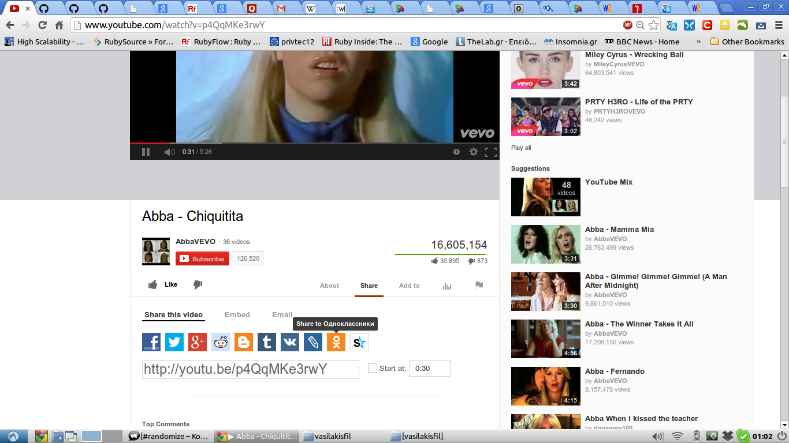
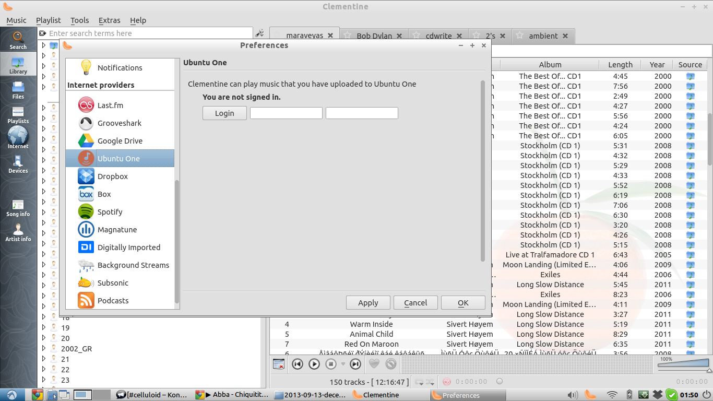

If you look around you (in the Internet that is) you will se a huge explosion of social networks. It makes sense actually: humans are social creatures. The thing is that these social networks are so much fragmented that most people try to keep up either with the most known or the ones that are really fond of.

Personally I hate when things are build with such limitations. I believe that it is either lack of imagination or money. Even my blog, I wanted it to be [platform agnostic](/blog/2013/09/01/my-octopress-blog-setup/) so I can move to a new blog house ANY time I want (for instance [Ghost](http://ghost.org/), seems a very promising blogging platform).

## The problem in one look
The problem of Internet Centralization can be seen in a simple image.

Take a look on how many social networks you can share this video. And
these are only the tip of the iceberg, that is, only the most famous ones. There are many many many more.

Here the problem, in fact, is not that a user will most probably have
multiple accounts in order to fill his social internet. I think the bigger problem is that these networks don't communicate with each other in a natural way. In fact each OSN has its own API for an action as simple as that and what is more, youtube here provides only the most popular ones. For youtube any other OSN just don't exist (=doesn't worth the effort to create a share button). Even if youtube was more friendly and wanted to add even more networks, we would have lines of buttons in order to share a single video. Funny ah?

Let's go a step further and see what would be better:

* From the **user**'s side I think it would be better if youtube knew which accounts I have (this can be achieved in some extent by using OpenID) and show me only these buttons plus a button in order to publish it in all networks (this can be achieved only if the OSN provides support for it).

* From the **developer**'s point of view it is very frustrating to work tones of different API's that do exactly the same thing. It's just a video share why should it be so different for each OSN?

If we go 2 steps further then **our whole infrastructure has failed**. If I have to keep up with 10 OSN accounts in order to fulfil my social need then something has gone really wrong. Why should I have to constantly check 10 inbox messages, 10 updates feed etc etc?

What I really need is a dashboard that can manage all my social contacts. Sure, there can be many types of contacts(=relationships) but I bet this can be fixed (Google+ actually tried to address this issue through circles but eventually fucked up all my contacts). Why on earth do I don't need multiple accounts, inboxes and updates.

However this is the last thing that a big player like Facebook would like. For a social app the most vital thing in order to succeed (and increase its net worth) is to increase its users and never let them go at any cost otherwise the app itself will go bankrupt. This greedy attitude has many side effects to the end users which are actully connected to the fact that the main purpose of today's online social apps is to increase their profit instead of serving the users in the best way. It also has a name: [*silo*](http://indiewebcamp.com/silo).

> A silo, or web content hosting silo, in the context of the IndieWeb, is a centralized web site typically owned by a for-profit corporation that stakes some claim to content contributed to it and restricts access in some way (has walls).

Silos can be seen everywhere where the profit is the main objective of a company. When you have a promising product which attracts a lot of users, in order to preserve your users you create walls around your product so that you have the least possible leak of users or data. We have seen this in many products, Windows, Facebook, Twitter..

## Problems of Centralized Internet
Although one could argue that Silo based applications tend to provide more features they have some inherent problems, especially the apps in the field of social internet.

* In centralized apps, data can be manipulated by anyone. It is well-known that the massive search engines and social networks sell their data to big advertising companies. Actually there is no guarantee that in the furure users' data will not be misused. * There are well known problems, concerns, and complaints about users' privacy in centralized apps. Google search engine records all your search history whereas in facebook nothing is actually deleted: it is just hidden from your timeline (it might be more efficient/cost less actually).
* A centralized application which does not provide data interoperability might close down any time in the future,
thus sucking up their users. (Reprsentative examples: Google Reader, Posterous, and [many more](http://indiewebcamp.com/site_deaths)..)
* If there is a hacker attacks in the centralized service, this would affect ALL users
* Using OpenID big players always keep their users active. Imagine that: you have a facebook account and through that (and using OpenID) you have signed up and created a profile in other social networks too with just one click. However, now if you try to shut down facebook you will loose any other social account that **depends** on facebook.
* Services are designed to be profit-centric and not user-centric: actually companies do not **respect** users Your data is their money, so they will do anything to keep you always active, connect with others and never let you go..
* Having such architecture is very inneficient for **mobile devices** since instead of only one process listening
for new events now you have as many processes as your social apps with notification support.

Check out one more picture:

Here, clementine is a very decent music player that enables you to have your songs in a cloud service. After you login to your favorite service, it automatically fetches them in its SQLite database and then you can stream any song.

The thing here is that we have 12++ cloud services, each one has each one (not always RESTful !) API which essentially does exactly the same thing. It fetches files from the cloud to the end user.

In order to support all these different providers (that actually do the exact same thing), clementine contributors have written 19594 lines of code in [146 files](https://code.google.com/p/clementine-player/source/browse/#git%2Fsrc%2Finternet). They actually are different handlers for each cloud service.

What do you think? Are you happy with our social infastructure ?
