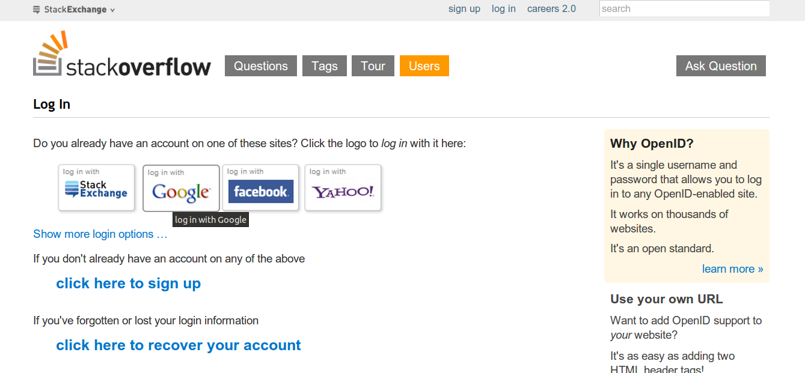

Have you tired of remembering the combination of username/password for each website that you are registered? Do you hate of creating a new account for each new social web application that comes up to surface?
Well [OpenID](http://en.wikipedia.org/wiki/OpenID) claims that it is the solution to these problems and many more! Without going to detail, OpendID is an open standard that allows you to authenticate to any site that supports it without actually having to sign up for the website. Instead, you authenticate yourself as a user of your OpenID provider (for instance Google is an OpenID provider). The mechanism behind OpenID is known as [zero knowledge proof](http://en.wikipedia.org/wiki/Zero-knowledge_proof).

For instance if you want to log in [stackoverflow](http://stackoverflow.com/users/login) website, it shows you many options:

You can log in using either StackExchange, Google, Facebook or Yahoo account. Only if you don't have any of the aforementioned accounts, it suggests you to sign up for a new account. It makes sense. With OpenID you can choose only one OpenID provider and use that for all websites. Or maybe not?

No, not actually. If you look around you, you will see that the only stable OpenID provider that is supported to almost any social web app is Google's and maybe Yahoo's. Facebook officially does not provide OpenID. Instead it uses its own authentication system. Same goes for Twitter. Other independent OpenID providers such as MyOpenID, since no one had support for them, they [shut down](http://thenextweb.com/insider/2013/09/04/myopenid-to-shut-down/).

So what OpenID does exactly? It forces you to use one of the most known web sites. So, when you log in to a web app X using Y's as OpenID provider you are forced to have Y's account always activated otherwise you will lose the ability to log in X web app.

In essence OpenID is a delusion. It was mainly created by Microsoft's, Google's and Yahoo's engineers and what they achieved is to literally dominate the field.
