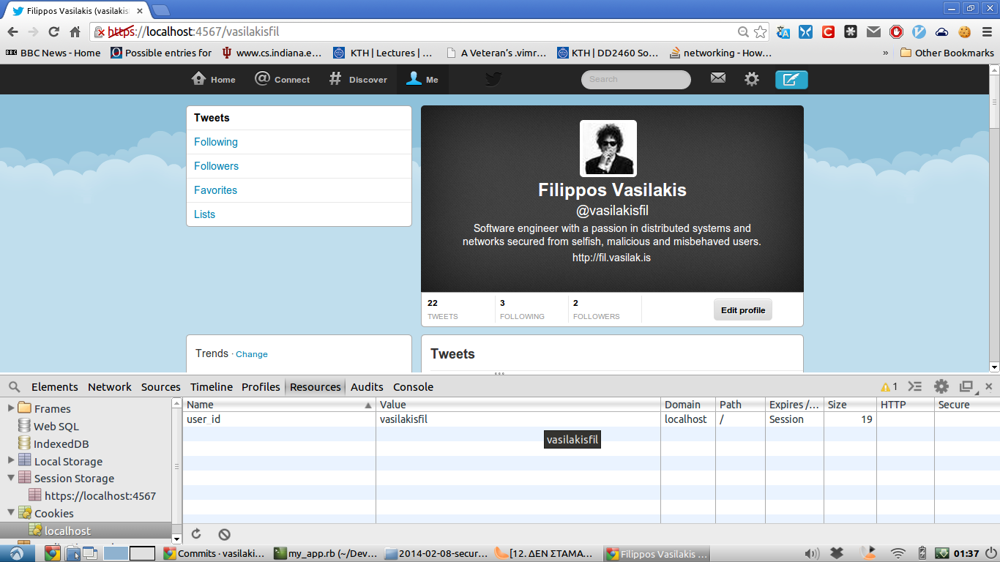
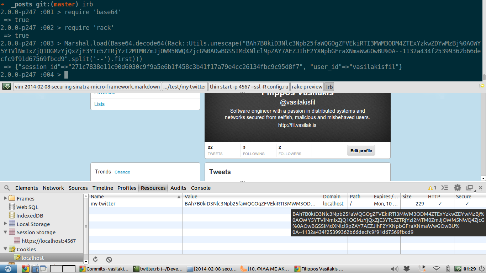
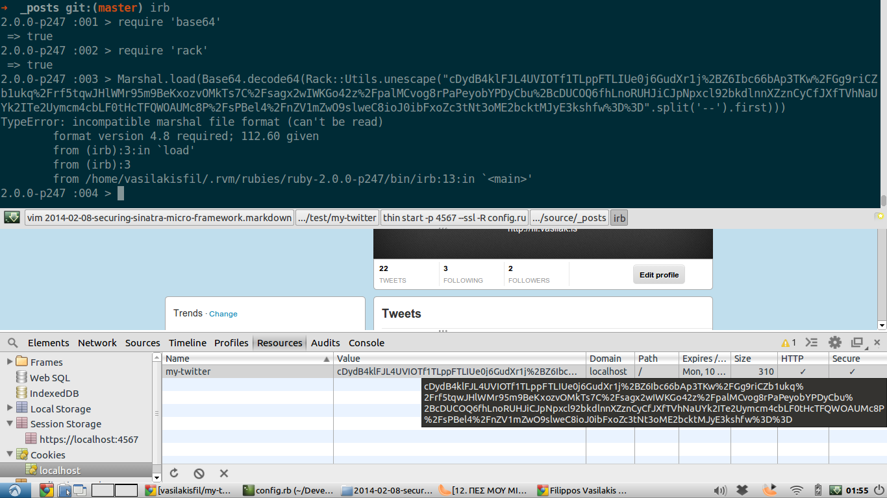

[Sinatra](http://www.sinatrarb.com/) is an amazing micro-framework that enables you ti build anything from scratch. Of course it does not have Rails' helpers  but it does not contain any magic either, in contrast to Rails. Once you get familiar with it you can build a web app. It is mostly used as a tool for creating web services, RESTful APIs or simple web apps.

Although so simple and powerful, Sinatra needs to be secured in order to push your app into production. Here we will talk about securing Cookies, Sessions and avoiding XSS/CSRF attacks. As a testing app we will use a twitter (clone) client that I build these days in Sinatra, which can be found [here](https://github.com/vasilakisfil/my-twitter).

### Sinatra's Cookies
The first thing you can use for keeping the state of the client through the HTTP protocol, is to use cookies.

You can create/delete a cookie by using the response object. To create a cookie: `response.set_cookie('my_cookie', 'cookie_value')` and to delete the same cookie: `response.delete_cookie('my_cookie')`. This actually calls the underlying Rack's `set_cookie` method from [Rack::Response](http://rack.rubyforge.org/doc/classes/Rack/Response.html) which subsequently calls the [Utils.set\_cookie\_header!](http://rubydoc.info/gems/rack/Rack/Utils#set_cookie_header%21-class_method) (check the source code !) You can also use the [Sinatra::Cookies](http://www.sinatrarb.com/contrib/cookies.html) extension.


*Using cookies, a user can see the actual value or even change/set the value.*

The first precaution measure you should take is to require cookies to be http only by setting the **HttpOnly** flag in the HTTP response in the cookie header field. This flag says to a (modern and non malicious) browser that cookies can only change from the server and not from the browser. Hence, it protects your users from *some* [XSS](http://en.wikipedia.org/wiki/Cross-site_scripting) type attacks. If you checked `Utils.set_cookie_header` source code you will see that the third argument (value) can accept a hash too. By something like `response.set_cookie('my_cookie', { value: 'cookie_value', httponly: true })` you set this flag on. I remind you that this flag does not protect you much and it can be bypassed by many ways (a [popular](https://www.owasp.org/index.php/Cross_Site_Tracing) way).

You should also set your cookies to be secure using the **Secure** flag. This protects you from MITM attacks and requires to send the cookies only through HTTPS connection which uses the underlying secure SSL/TLS protocol. If the browser denies to setup a symmetric key with the server through HTTPS, the server will send the response without the cookies (which essentially will be useless). To achieve that use: `response.set_cookie('my_cookie', { value: 'cookie_value', secure: true, httponly: true })` (spoiler: you need SSL/TLS enabled web server to use that)

There are some other security measurements that you can uses such as defining the **domain** that the cookies can be used, defining an explicit **path** that the cookie can be accessed and setting a relatively small expiration date by setting **max-age** or **expires** (although the latter is deprecated). If you don't set the last two then cookies expires with session, that is, when user closer her browser. Again check the [Utils.set\_cookie\_header!](http://rubydoc.info/gems/rack/Rack/Utils#set_cookie_header%21-class_method) for these options.

However it is highly recommended to avoid using cookies for such actions since users have fully access to cookies and thus they manipulate them without a lot of effort.

One last thing that you can do for cookies is encrypting them. This would make them *almost* secure but unfortunately there is no gem that provides an encryption for cookies. Instead we have some slightly better options...


### Sinatra's Sessions
Sessions are cookies but used in a smarter way. Instead the server to send all the data through HTTP headers and ask the browser to store them in cookies, the server stores some data in its memory and sends an [almost](http://en.wikipedia.org/wiki/Pseudorandom_number_generator) truly random string (also called unique session IDentifier) and asks the browser to store this string in the cookies. This string acts as a mapping to the memory address that the user's data are stored. In each request the browser sends, among others, all the cookies that this server has stored in the browser's cookies cash, in this case just the session ID. When the server receives this unique string it knows exactly where it should look for the user's data.

This technique has 2 advantages. First, in the server-browser interactions much less data are transmitted which is critical for minimizing the latency (especially in mobile devices, a popular trend in our days). Second and most important, the user/browser does not know any data the server has stored for identifying the user except this unique string. This doesn't mean that attacks are impossible because by stealing this unique string one can impersonate the legitimate user.
However XSS attacks can be reduced since the server can filter the attacks by matching the received unique string and the IP address of the received HTTP request or use other more sophisticated filtering mechanisms.

Using sessions in Sinatra is straightforward. First add before your routes `set :sessions, true` (when you set something to true there is an alias for that: `enable :sessions`). Then you can access a session by `session[:key] = 'value'`. In Sinatra sessions are not encrypted but instead they are only encoded in Base64. Strangely enough Rails 4 started to use encrypted sessions, before Rails 4 they were only checked for integrity and authenticity. In Sinatra you can enable integrity and authenticity using a secret in order to feed the underlying HMAC algorithm (the difference between MAC and HMAC is that the first is a technique in order to check integrity whereas the second is an algorithm that is used to check both integrity and authenticity using a secret key). In order to do that just add `set :session_secret, 'change_me'`. Also check the underlying Rack [method](http://rubydoc.info/github/rack/rack/master/Rack/Session/Cookie) which has a parameter to add an old secret for key rotation.

If you open chrome developer tools (ctrl+shift+J shortcut) you will be able to see the rack session ID. Unfortunately chrome does not allow to copy/modify the cookies so you will have to use a 3rd party extension to copy the cookie. Now, in order to decode it all you have to do is:

```language-ruby
2.0.0-p247 :003 > Marshal.load(Base64.decode64(Rack::Utils.unescape("BAh7B0kiD3Nlc3Npb25faWQGOgZFVEkiRTI3MWM3ODM
4ZTExYzkwZDYwMzBj%0AOWY5YTVlNmIxZjQ1OGMzYjQxZjE3YTc5ZTRjYzI2MTM0ZmJjOWM5NWQ4ZjcG%0AOwBGSSIMdXNlcl9pZAY7AEZJIhF2Y
XNpbGFraXNmaWwGOwBU%0A--1132a434f25399362b66decfc9f91d67569fbcd9".split('--').first)))
 => {"session_id"=>"271c7838e11c90d6030c9f9a5e6b1f458c3b41f17a79e4cc26134fbc9c95d8f7", "user_id"=>"vasilakisfil"}
```

Do you see something strange here? Sinatra implements **cookie-based** sessions by using the `Rack::Session::Cookie` class. This means that the theory that we described previously is not implemented here. Instead, Sinatra "emulates" sessions using cookies. This is bad since all the advantages we should have by using sessions and not cookies are gone. If we want to use inherent Sessions in the right way we have to implement our own Rack adapter. (even for rails the default is to use `ActionDispatch::Session::CookieStore` which stores everything on the client as cookies, and I think this is the default for Django too).



*Using Secure HttpOnly Sessions, a user can still see the actual values with a little more effort. Note the -- in the string! This is used to split the data from the generated [HMAC](https://github.com/rack/rack/blob/master/lib/rack/session/cookie.rb#L159) (only if you initialize sessions with :secret) so that both parties can check the integrity and the validity of the message.*

However by using sessions we can use a gem called [encrypted_cookie](https://github.com/cvonkleist/encrypted_cookie) which encrypts the Sinatra's sessions using 256-bit AES algorithm. I think this is the least thing you should do if you want a secure Sinatra application.

If you copy the string and try to decode it as previously you will get an error about Marshal format which rather expected since by encrypting the Base64 encoding(or encoding the encryption, I am not sure which happens first), the Base64 decoding generates an incompatible Marshal format.

Some other ideas to secure even more your Sinatra is to provide a different implementation on the the Rack::Session::Cookie that implement sessions in the right way (probably using a database) or even sending different session IDs for each client's request and requiring each request to be totally unique and different from any previous generated session ID.

### Other Security Enchancements

When you have forms on your app you should always use an **authenticity_token** to avoid cross site request forgeries. If you don't know what this is check [this](http://stackoverflow.com/a/1571900/1291118) very good explanation. Fortunately, inspired from rails, there is a gem that helps you with that, called [rack_csrf](https://github.com/baldowl/rack_csrf). As the name suggests it works in the rack and it is not created specifically for Sinatra, as a result, you can use it in any application that uses Rack below. I will mention again that encrypting the sessions is vital to increase your security. Authenticity token is stored in the session (at least in Sinatra, in Rails it is easy to use the database for that) so given that in Sinatra sessions are cookie-based anyone who has access in client's unencrypted cookies can see the authenticity token too. What actually protects you is encrypting the sessions.


*Cookies encrypted and cannot be recovered but only by the server. Note that crsf_token is encrypted too.*

Last but not least always use **HTTPS** (which is based to SSL/TLS) everywhere in order to avoid MITM attacks. It is required anyway since by requesting secure cookies and without SSL/TLS, the cookies will not be sent to you and you won't be able to use the app. In order to use ssl you will probably need to change the web server from Webrick to something else. With Thin web server you can use this the following config.rb for configuration:

```language-ruby
require './my_app'
require 'encrypted_cookie'
require 'rack/csrf'

module YourApp
  def self.app
    yaml_config = YAML::load_file('config.yml')
    Rack::Builder.app do
      cookie_settings = {
        :key          => 'your-key',
        :path         => "/",
        :expire_after => 86400,             # In seconds, 1 day.
        :secret       => yaml_config["cookie_key"], # this has to be generated by a PRNG function
        :secure       => true,
        :httponly     => true
      }
      # AES encryption of session cookies
      use Rack::Session::EncryptedCookie, cookie_settings
      #use Rack::Session::Cookie, cookie_settings #<--- use this if you don't want encryption
      use Rack::Csrf, raise: true
      # other stuff here
      run App
    end
  end
end
```

Then with a very simple config.ru, start your Sinatra App by typing `thin start -p 4567 --ssl -R config.ru`.
