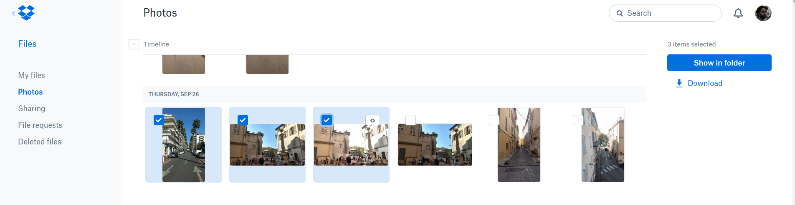
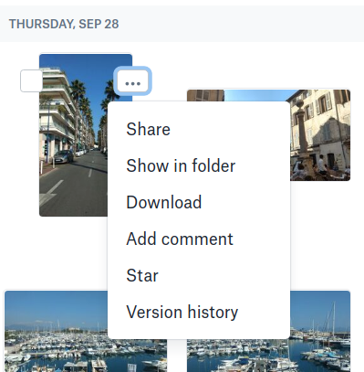
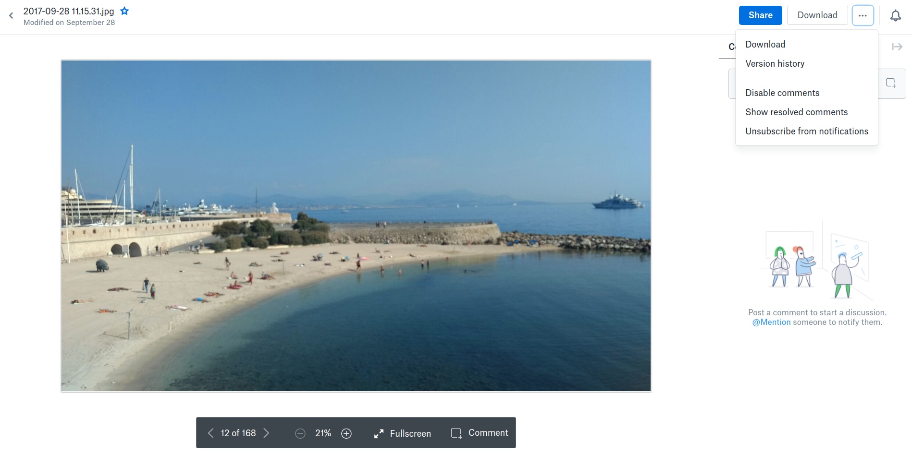
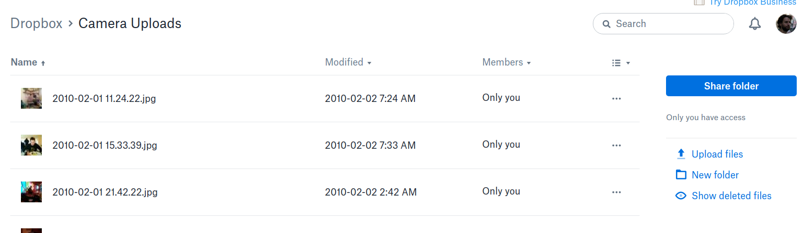

Yesterday my mum asked for my help regarding "something was changed in Dropbox and I can't delete my photos".
You see my mum and my dad are over their 60s and didn't grow up with computers.
And that makes a *huge* difference.
They don't really understand what a folder is and what is its relation related to other folders (the filesystem structure, that is),
they haven't linked the notion of common UI elements (like a checkbox) with their actual function.
They just memorize things, and rarely do they think more complex, like combine previous experiences and knowledge in order
to figure out what they need.
And given that they are a bit old, it's a bit tough for them to learn new things so sometimes I have to repeat them
the same things (like what tabs are and what windows are).

When I heard about her problem I was almost sure that it was yet another PEBKAC case.
So I sat next to her to show her how it's done.
Only to find out a few minutes later that it was super tough, practically impossible for her.
I mean what the heck Dropbox ? **You make it super hard so that people start paying?** (note: my mum is a paying customer years now)

So, once upon a time, Dropbox had a menu called "Camera Upload", that listed all your photos that your phone uploaded.
They change that so now you have to go a bit further: you have to click Files and then Photos.
You see, Dropbox is associated to most people's mind as "the service that I upload my camera's photos" so they thought
altering the UE a bit (to the worse) **to market that its service can do other things as well**.

Well that's OK, it _was_ still doable. But let's be frank: everyone navigates his/her photos through that menu ([https://www.dropbox.com/photos](https://www.dropbox.com/photos)),
**they know it from internal metrics pretty well**, yet you can't delete a photo from there (intentionally probably).

Selecting a couple of photos? Nope, no delete photo. You only get, show in folder and download, like Delete would make the UI shitty or was
very difficult to add there.

Checking the menu of a single photo? Nothing there either.

You do get 6 options in the menu of which, 3 are related to their growth techniques, comments,
share and star. I don't have internal metrics of Dropbox but I doubt comments and star are used much.
But hey you know they need to grow their service..

You navigate inside a photo? Nothing there either.

You get literally nothing here regarding deleting, but mentioning someone through comments?
Definitely, clearly visible because it's on Dropbox's priorities so that their
social system flourishes up and their stock value increase.

Of course Dropbox would hate if it was easy for people to delete their photos. How would they increase their income..
But eventually how is it possible to achieve deleting a photo?

Well you have to go inside the My Files menu, navigate to the Camera Uploads folder (like my mum knows all those things, sure)
and then you get a totally different view where you can actually delete staff.

But the UI is optimized for files not photos, as a result you get super small thumbnails (like my my mum can see pretty well in her 60+s),
an ugly list, one of those we had 10 years now in operating systems.
**Totally unpractical**, like if you need to find a photo taken in June, you have to first setup the sorting order and sorting by option, and
then try to search it (using your eyes) based on the date string found in the 3rd column. Wtf?

**I hate it when companies (and UX/UI designers) prioritize company's value over user's experience.**
I thought UX meant something else once upon a time..

A note: After a while my dad was trying to explain me that he can do it in his computer. I asked him how.
He showed me that Mac's native image viewer app, which had an option of delete, by pressing (Mac's equivalent) right click.
This is how old people perceive user interfaces.
