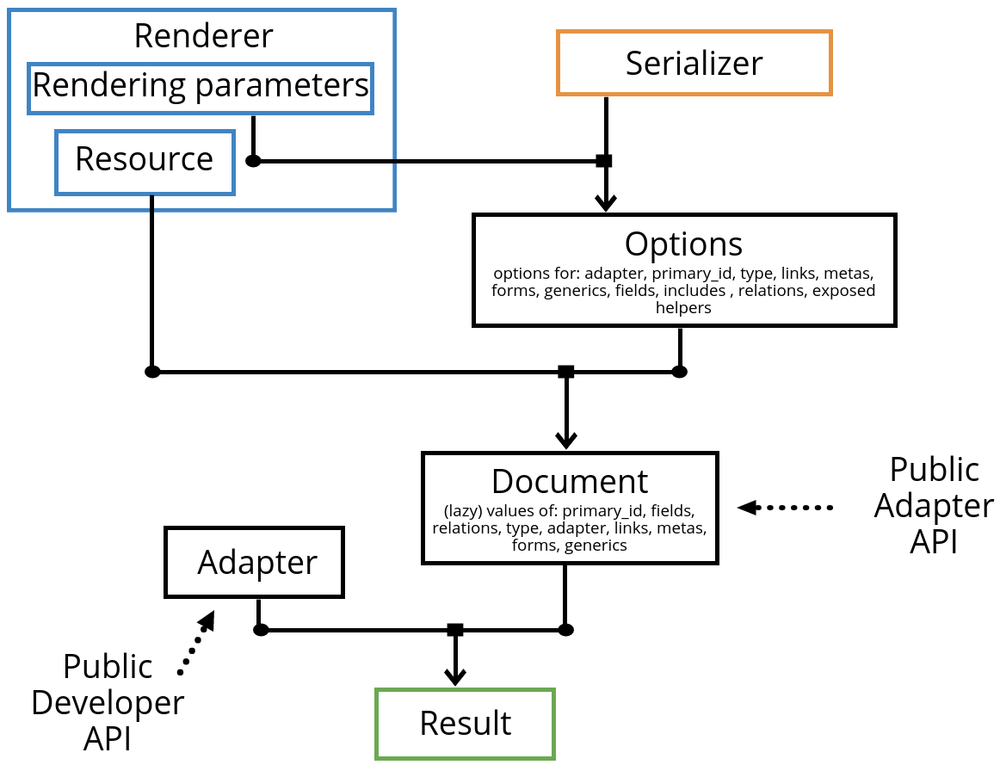

Long time no see!
This time I would like to write about a library I was working about a couple years ago,
a serializers library in Ruby.
I have actually finished it about a year ago and I always wanted to create this blog post
but last year has been super busy for me so never got the chance to present it properly :)

READMORE

But first I would like to talk about serializers in Ruby from a historical perspective :)

### Ruby serializers in 2013-2014
Back in 2014, when I started working with APIs, go-to library for serializing Ruby
classes was [ActiveModelSerializers](https://github.com/rails-api/active_model_serializers), the newly published 0.9.x version.
Back then, with this awesome library we were building basic GraphQL-like structures, before
GraphQL was even announced! It was a joy working with a such powerful tool
where the client could specify which fields it needs from a specific resource but also
which relations.
You could inject exactly what you needed when you were actually rendering the serializer
which meant that you could take a union of client's desired fields/associations,
the default fields/associations (if client's input was empty), and what client was allowed to access.
The result was a super flexible API.

Apart from AMS, there was [Oat](https://github.com/ismasan/oat) a pretty nice little library which supported
out of the box [HAL](http://stateless.co/hal_specification.html), [Siren](https://github.com/kevinswiber/siren) and [JSON:API](https://jsonapi.org/), and [jbuilder](https://github.com/rails/jbuilder) which for some
reason felt like Godzilla to me at that point, but to be honest it's a completely proper way of
building hypermedia APIs in Ruby since you can do a lot of cool stuff with caching.
However the catch is that you can't create reusable adapters, basically it's like
Rails views, everything needs to be implemented from scratch.

### Ruby serializers in 2015-2016
Going forward, in 2015, the AMS rewrite had already begun since 2014 for the
0.10.x version. For various reasons, in the company I was working at that time, it was decided
to go with the 0.10.x and of course we completely regretted it. At that point it was 0.10.RC4 that we
were using, just 1 RC release before the 0.10.0. Now you can tell me, "of course
what do you expect? You were using an RC version" and you might be right. Only that the frustration
didn't come from things that weren't polished 100%.
I would be fine with that and I was eager to help out.
The frustration came from the fact that the architecture was a completely different beast
from 0.9 and 0.8 versions, everything were different, code and (the sparse) documentation.
And I am saying this because I [did try](https://github.com/rails-api/active_model_serializers/issues?utf8=%E2%9C%93&q=author%3Avasilakisfil) to help out sending pull requests, and the more
I was working with the code, the more frustrated I got.

Here are some things that come to my mind:

* both 0.8/0.9 and 0.10.x are using the same repo, although they share completely different
API/code, making things extremely confusing from a API developer perspective, but also
very difficult to manage as well from a contributor's perspective
* super complex overall architecture
* the gem made JSON:API as first citizen. That's inflexible to build adapters for different
specs and has affected pretty much everything in the code.
The previous versions were using the AMS API style (mostly json with some very basic patterns). 0.10.x version
also supported that style but the code for that was like a completely different
branch inside the code (not sure if it's still like that but I guess it is).
I understand that JSON:API is a quite popular spec, but tight the whole generic library to that
spec is a bad design, I think.
* too many dependencies (requires ActiveSupport..)
* tightly coupled to ActiveRecord (at least at that time, not sure if now has changed..)
* caching was implemented in the same library. I really thing that's a completely different concern..
* some parts did not match the Ruby coding style (like include: 'a,string,of,resources', default_includes '**')
* maintainers were reluctant to merge pull requests, because even in the Github issues was an extreme
confusion of what's implemented, what's missing, what bugs exists etc

In one word **it was a failure**. Like, imagine the most popular Serializers gem in Ruby,
Rails team [was pushing them](https://medium.com/@joaomdmoura/the-future-of-ams-e5f9047ca7e9) to finish in-time before the release of Rails 5 so they can include
it in the same release (although completely different gem, I guess they would make a note about it),
maintainers were struggling to make this happen and of course it didn't.

Now I should also pause a bit and say that **I have nothing against the commiters/maintainers**.
They definitely **did their best, and the problem wasn't lying there**.
It's just that sometimes Open Source projects fail.
And in my experience they fail, when there isn't a very tight core team that has the same vision,
coding style and are gatekeepers in pull requests, until the library has proved itself.
Then, any new pull request will probably respect the existing code and won't challenge it.
Merging code will be much easier, at that point.

Instead with AMS, **different people started the rework, different people took over
and did their best to finish it**, and for the whole time, various people were sending pull
requests for various features and bugs, of course to help out, but what happened
was a very complex architecture with no clear design and vision.
Actually it would be a great idea to take some interviews by the project contributors at that time.
I think they will have some insights to contribute regarding to what happened :)

During my frustration with AMS I always wondered: how difficult can it be to
build a feature-complete Ruby Serializers ? Well, it turned out to be a bit more complex
than I initially thought. **Way more complex** :)

### Ruby serializers in  2017-2018
I guess I wasn't the one who was a bit frustrated with AMS.
[beauby](https://github.com/beauby), an AMS core member went off and created a JSON:API specific serializers gem,
the [jsonapi-rb](https://github.com/jsonapi-rb).
It follows spec pretty well and should be fine using it.
It's also dependency free.

On the other hand, a year later (2018) Netflix came over and published [their own
JSON:API serializers gem](https://github.com/Netflix/fast_jsonapi) which is extremely fast to be honest.
Like **SUPER FAST**.
Unfortunately it requires ActiveSupport as a dependency (not sure why, earlier releases didn't)
and that could be a bummer for some applications.
Also it might not be as flexible as AMS or jsonapi-rb (although latest releases have
closed the gap A LOT), but in my experience it's flexible enough that you will
almost never need to look for something else.

### Ruby serializers today
Today, if someone asked me which Serializers gem should I use, I would tell him/her
go for the [fast_jsonapi](https://github.com/Netflix/fast_jsonapi) gem. It's super fast, it supports a quite popular API
spec and you must have a really good reason to not use it.

Personally, **I am a bit against of having links inside the response**, treating the
client as plain stupid. That's one of the reasons why I don't like JSON:API.
I think it's just too verbose.
(The other reason is the naming: they picked up the 2 most popular words regarding APIs,
_JSON_ and _API_, glued them together and made the name, feels so much cheating..)
I like to load off some work to the client using introspective
methods. I have talked [about it](https://introspected.rest/) some time ago.
But if anyone came and asked me what I would suggest for a brand new API, my
answer would be pretty straightforward: **JSON:API, unless you have good reasons
not to**.

It's the more experienced API designers that might want to implement something more
versatile and more advanced, tailored to a specific use case.
Or might want to experiment a bit.
For instance, another cool API spec that's in the same philosophy as JSON:API is
[Ion](https://ionspec.org/).
Not as popular as JSON:API but worth checking it out!
Problem is that when you need to implement something different from JSON:API,
in Ruby you don't really have much options. Well you have, it's AMS but it will
be pain in the ass to create a custom serializer from that one.
And it will be painstakingly slow.
And you can't have more advanced concepts, like forms, relations on collections
etc.
Or you could use [jbuilder](https://github.com/rails/jbuilder), but the problem with jbuilder is that it can't
have the notion of adapters, hence you always need to build the final result
from scratch. Not fun.

### SimpleAMS: Modern Ruby Serializers
When I started working on the prototype of SimpleAMS, I set a couple of goals.

* I wanted the library to be super simple, easy to use with injectable API and clean code.
Have you seen [pundit](https://github.com/varvet/pundit)? I want a pundit for serializing.
* One of the things that I sometimes don't like in Ruby coding style, is the level of assumptions that the
code makes on behalf of you.
It had been a quite common pattern in Ruby/Rails that lead to many confusion of what
exactly the API is while at the same time such patterns reduce the flexibility.
The code is trying to act smart, but the drawbacks of such smartness overweight the gains.
I feel some basic assumptions which can be overridden at anytime is the ideal.
Embracing clean, explicit code is what I want, so that you can understand what's happening instantly.
* I wanted to create a generic abstraction as a first class citizen. From there
you should be able to implement any serializer needed, but that abstraction should be
powerful enough to cover even the most extreme corner cases.
After all, it's tough to beat [fast_jsonapi](https://github.com/Netflix/fast_jsonapi), that's shouldn't be my goal ;)
* I wanted super clean code, no smarty complex meta thingies inside the code.
I also wanted expected behavior on the internals and how it works when someone
started looking in the codebase.
Of course except the [DSL part](https://github.com/vasilakisfil/SimpleAMS/blob/master/lib/simple_ams/dsl.rb), which uses some advanced Ruby metaprogramming concepts,
but that's necessary if we want it to work with just an `include`.
* Much faster than AMS, it's well known that AMS is quite slow so that should be easy :)

### The API
Before starting on any new project, I like to put my imagination and come up
with a useful API and use cases.
Being in god mode, and leaving all the constraints on the side, you can come up with
some really cool APIs.

#### DSL based API
So how would you use a serializers library in Ruby?
I want to avoid any inheritance in order to use SimpleAMS,
because it puts many restrictions (given that you can inherit only from 1 class in Ruby).
It's better to include a regular module
and let it do all the necessary work needed using Ruby's hooks (which is [a lot](https://github.com/vasilakisfil/SimpleAMS/blob/master/lib/simple_ams/dsl.rb) of work).
In SimpleAMS, the DSL is very expressive, similar to the DSLs of the other gems:

```ruby
class UserSerializer
  include SimpleAMS::DSL

  adapter SimpleAMS::Adapters::JSONAPI

  attributes :id, :name, :email, :created_at, :role

  type :user
  collection :users

  has_many :microposts
end
```

Some notes:

* the adapter takes a class, which means, you can
inject your custom adapter (which might inherit from JSON:API default adapter).
* SimpleAMS is **dependency-free**, that's why you also need to specify the name of the
collection (which is what `collection :users` does).
This is needed, unless we want to bring in an inflector library (like ActiveSupport),
but I really don't see the point of bringing yet another dependency, especially
a dependency that is as large as ActiveSupport.

That's a simple example but SimpleAMS DSL boils down to the following patterns:

##### value-hashmap type of directives
These are directives like `adapter`. They take a value, and optionally
a hashmap, which are options to be passed down straight to the adapter, hence they are
adapter specific.
For instance:

```ruby
adapter SimpleAMS::Adapters::JSONAPI, {root: false}
```

here the `root` option is passed down to the adapter specified, and is specific to the
adapter.
Such options are `adapter`, `type` and `primary_id`.

Of course, since we are talking about Ruby here, it would be a huge restriction to
not allow dynamic value/hashmap combination. Basically **any such directive can
accept a lambda** (generally anything that responds to `call`) and should return
an array where the first part is the value and the second part is the options.
There is an argument that is passed down to the function/lambda, and that's
the actual resource. It would be pointless however to change the adapter
when trying to render a collection of resources (that's the definition of undefined behavior)
so for that specific directive the lambda will fail.
But for `primary_id` or more importantly `type`, that's a life saver because
it's the only way to render polymorphic associations:

```ruby
type ->(obj){ obj.class.to_s.downcase }
```

As I said previously value-hashmap directives are `adapter`, `type` and `primary_id`.

##### name-value-hashmap type of directives
These are similar to the above, only that they also have an actual value, which is
converted to a representation through the adapter.

For instance, think about a links.
According to [RFC 8288](https://tools.ietf.org/html/rfc8288#section-2), a link has

* a link context,
* a link relation type,
* a link target, and
* optionally, target attributes

Now, if we wanted to translate that to our serializers, a link could look like:

```ruby
link :feed, '/api/v1/me/feed', {style: :compact}
```

Here obviously the link context is the serializer itself, the link relation is
the `feed`, and the value is `/api/v1/me/feed`.
Now you can say, `feed` should be the name of the link which is different from
the relation type. The relation type could be `microposts`.
And actually, that's the case for [JSONAPI v1.1](https://jsonapi.org/format/1.1/#document-links).
In that case, the `feed` should be treated barely as a name (whatever that means)
and relation type will be put inside the link options like:

```ruby
link :feed, '/api/v1/me/feed', {rel: :microposts, style: :compact}
```

SimpleAMS has various such options like: `link`, `meta`, `form`, and the more
abstract `generic`, where all the rest inherit from and is intended to be used
for adapter-specific scenarios or things we haven't figured out yet in APIs.

**And I believe that that's the true power of libraries**: don't presume anything,
sure give some facilitators, but in the end, let the developer decide how to build upon your library.
Because there will be use cases that you haven't even thought and restricting
those would be a bad design.

##### fields directive
That's the usual attributes directive

```ruby
attributes :id, :name, :email, :created_at, :role
```

I have kept `attributes` for historical reasons, however using `fields` is also
valid, it's just an [alias](https://github.com/vasilakisfil/SimpleAMS/blob/master/lib/simple_ams/dsl.rb#L130-L137) after all:

```ruby
fields :id, :name, :email, :created_at, :role
```

Of course, any field can be overridden by defining a method of the same name inside
the serializer. In there, you can have access to a method called `object` which
holds the actual resource to be serialized:

```ruby
def name
  "#{object.first_name} #{object.last_name}"
end
```


##### Relations (has\_many/has\_one/belongs\_to)
These directives allow us to append relations in a resource.
`has_one` is just an alias of `belongs_to` since there is no real
difference in APIs.

```ruby
has_many :microposts
```

Again, it can be overridden by defining a method of the same name:

```ruby
def microposts
  Post.where(user_id: object.id).order(:created_at, :desc).limit(10)
end
```

Relations are a bit more complex actually. Specifically, what is `microposts`, the symbol ?
Is it the relation name? Is it the relation type? And how can you specify
that you want specific attributes for that relation.

Turns out, if you think about it, that relations is just a recursive thingie.
Let me explain myself: behind the scenes, the relation above tries to render the
method result using a serializer called `MicropostsSerializer`. If such serializer
doesn't exist it will fail throwing an error. Let's say that you have your own
serializer that looks like that:

```ruby
class MicropostsSerializer
  fields :id, :content, :created_at, :updated_at

  type :micropost
  collection :microposts
end
```

And here starts the interesting part: you are able to override any directive
defined in the serializer to acquire **a subset but never a superset**.
For instance, if you want to show only the content, you could do the following:

```ruby
has_many :microposts, serializer: MicropostsSerializer, fields: [:content]
```

but then, sometimes, an annoying spec might define parts of a relation in the main body,
while parts of the relation somewhere else. For instance, JSON:API does that by having some links
in the main body and the rest in the `included` section.
That's also possible if you pass a block in the relation directive:

```ruby
has_many :microposts, serializer: MicropostsSerializer, fields: [:content] do
  #these goes to a class named `Embedded`, attached to the relation
  link :self, ->(obj){ "/api/v1/users/#{obj.id}/relationships/microposts" }
  link :related, ->(obj){ ["/api/v1/users/1", rel: :user] }
end
```

Inside that block, you can pass any parameter the original DSL supports and will
be stored in an `Embedded` class under `MicropostsSerializer`.

Btw SimpleAMS is smart enough (one of the very few cases that acts like that)
to figure out that if a lambda returns something that's
not an array, then this must be the value, while options are just empty.

Another thing, is that sometimes, we want to detach the relation's name from
the type. `microposts` here is the relation name (again, whatever that means), while the type is defined by
the `MicropostsSerializer`, unless we override it, which can be done either
in the relation serializer itself, or when we use the relation from the parent serializer:

```ruby
has_many :microposts, serializer: MicropostsSerializer, fields: [:content], type: :feed do
  link :self, ->(obj){ "/api/v1/users/#{obj.id}/relationships/microposts" }
  link :related, ->(obj){ ["/api/v1/users/1", rel: :user] }
end
```

Internally SimpleAMS, differentiates `type` from `name`, and usually `type` is
something that's semantically stronger (like a relation type) than `name`.
You can even inject the name of the relation using the `name` option:

```ruby
has_many :microposts, serializer: MicropostsSerializer, fields: [:content], type: :feed, name: :posts do
  link :self, ->(obj){ "/api/v1/users/#{obj.id}/relationships/microposts" }
  link :related, ->(obj){ ["/api/v1/users/1", rel: :user] }
end
```

As I said, the name, which is usually the name of the attribute that includes the relation
in the JSON format, doesn't really have any semantic meaning in most specs.
At least I haven't seen any spec to depend on the root attribute name of the relation.
Instead it's the type that's important, because `type` is what the web linking RFC defines.
However, being able to specify such things like `name`,
is crucial for cases that go beyond the trivial boundaries of a usual API
because it enables the API or SimpleAMS adapter developer to achieve exactly what's needed (using a
public, stable API as we will see later).

##### collection directive
The collection directive is yet another thing that I haven't seen in any other serializers library.
We saw it previously as:

```ruby
collection :users
```

It basically tells the name of the resource in plural.
It's needed, if your adapter serializes the collection using a root element.
But it can do much more than that: it allows you to define directives on the collection level.
For instance, if you want to have a link that should be applied to the collection
and not to each resource of the collection, then you need to define it inside the collection's block:

```ruby
collection :users do
  link :self, "/api/v1/users"
end
```

Or if we also want to have the total count of the collection, that should go in there actually:

```ruby
collection :users do
  link :self, "/api/v1/users"
  meta :count, ->(collection, s) { collection.count }
end
```

Again, inside that block you can define using the regular DSL, whatever you would
define in the resource level.
It's just yet another level of recursion since, the same things that I show
you here can be applied in the collection level inside the block.
For instance, in theory (and if the adapter supports it), you can specify relations
that apply only to the collection level:

```ruby
class UserSerializer
  include SimpleAMS::DSL

  adapter SimpleAMS::Adapters::JSONAPI

  attributes :id, :name, :email, :created_at, :role

  type :user
  collection :users do
    link :self, "/api/v1/users"
    meta :count, ->(collection, s) { collection.count }

    has_one :s3_uploader #whatever that means :P
  end

  has_many :microposts
end
```

I think that such designs make things quite robust since you don't have
corner cases and iffy situations.
SimpleAMS defines a robust DSL that can be applied in many parts.
Until now we have seen that it can be applied in the Serializer itself, in the
relations and inside the collections. As we will see, there is one more place
that can be applied: when trying to render a resource using a serializer.

#### Rendering
When rendering a resource, it should be straightforward:

```ruby
SimpleAMS::Renderer.new(user, {
  serializer: UserSerializer,
}).to_json
```

All you need is to specify a serializer.
In the example above, the resulted resource is a reflection of what is defined
inside the serializer.
However, as we have said previously, the serializer acts as a **filtering mechanism**,
meaning that you can override anything the serializer defines, given that the
result creates a subset and not a superset (any superset options will be ignored).

For instance, you can override the type dynamically:

```ruby
SimpleAMS::Renderer.new(user, {
  serializer: UserSerializer, type: :person
}).to_json
```

or you can override the relations, and specify that you don't want to include
any relation defined in the serializer:

```ruby
SimpleAMS::Renderer.new(user, {
  serializer: UserSerializer, includes: []
}).to_json
```

or specify exactly what fields you want:

```ruby
SimpleAMS::Renderer.new(user, {
  serializer: UserSerializer, fields: [:id, :email, :name, :created_at]
}).to_json
```

or even specify the links subset that you want:

```ruby
SimpleAMS::Renderer.new(user, {
  serializer: UserSerializer, fields: [:id, :email, :name, :created_at],
  links: [:self, :comments, :posts]
}).to_json
```

Note that there is no `only` or `except` that used to be in some AMS versions.
Although handy, these create more complexity (= more bugs) in the serializing library
and the real benefit is very small (in fact, only `except` functionality is missing here).

As we have noted, you cannot override fields, relations, links etc in a way that the end
results has more links that are not defined by the serializer.
Internally, even if you add extra fields at the time you render the resource,
these will be ignored by SimpleAMS. A better, more defensive, practice would be to
throw an error, maybe a feature for the next release :)

I have worked many years building APIs and the most useful pattern I have seen
is the one where you inject everything you might need when you render the resource.
Because usually at that moment, you have all the necessary information to authorize
the incoming request:

* which user the request represents, if any
* which resource the user/guest tries to access
* what permissions the user/guest has on that resource, for the specific action requested:
  * which fields, attributes, relations, links etc the user/guest has/should have access to
  for the requested resource

A different, quite popular actually, pattern is to have iffy states inside the serializer
based on some runtime injected information.
For instance in fast_jsonapi, it is defined like that (taken from the docs):

```ruby
class MovieSerializer
  include FastJsonapi::ObjectSerializer

  attributes :name, :year
  attribute :release_year, if: Proc.new { |record|
    # Release year will only be serialized if it's greater than 1990
    record.release_year > 1990
  }

  attribute :director, if: Proc.new { |record, params|
    # The director will be serialized only if the :admin key of params is true
    params && params[:admin] == true
  }
end
```

or for AMS (again taken from the official docs):

```ruby
class SomeSerializer < ActiveModel::Serializer
  attribute :private_data, if: :is_current_user?
  attribute :another_private_data, if: -> { scope.admin? }

  def is_current_user?
    object.id == current_user.id
  end
end
```


While I have nothing against that style, in my experience this style, in the long run,
**creates messy code that is more difficult to reason and test**.
Instead, you should use service objects and similar patterns to derive what you need:
**what** the user is allowed to access **from** a specific resource for a given endpoint,
**on** a given action.
Once you derive the necessary information, you just inject it to the renderer and
SimpleAMS will derive a subset between your derived/injected directives and the ones
defined inside the serializers, with the latter having larger preference.
In practice, that means, you need to specify the superset of attributes/relations/etc
of a serializer for the most authoritative role that might request the resource.
Then you start trimming down :)
You will mostly end up is trimming down by injection the fields and relations, rarely
links and meta and almost never anything different than those.

Rendering a collection is similar, only that you need to call `SimpleAMS::Renderer::Collection`
instead of just `SimpleAMS::Renderer`.

```ruby
SimpleAMS::Renderer::Collection.new(users, {
  serializer: UserSerializer, fields: [:id, :email, :name, :created_at],
  links: [:self, :comments, :posts]
}).to_json
```

Note that even with collection, by default everything goes to the resource.
If you need to specify options for the collection itself, you need to use
the `collection` key. For instance, having some metas inside the collection:

```ruby
SimpleAMS::Renderer::Collection.new(users, {
  serializer: UserSerializer, fields: [:id, :email, :name, :created_at],
  links: [:self, :comments, :posts],
  collection: {
    metas: [:total_count]
  }
}).to_json
```

Btw if you want to specify the actual values when rendering the resource,
rather than taking into account the serializer, you can inject a hashmap:

```ruby
SimpleAMS::Renderer::Collection.new(users, {
  serializer: UserSerializer, fields: [:id, :email, :name, :created_at],
  links: [:self, :comments, :posts],
  collection: {
    metas: {
      total_count: users.count,
  }
}).to_json
```

Of course, you can also pass a lambda there, but not sure what's the point since
the lambda parameter is the resource that you already try to render so it's
not going to give you anything more (and will be slower actually).


You might noticed that `links` or `metas` didn't appear when we talked about
the DSL, only their singular form (`link`, `meta`) suggesting that rendering DSL is a bit different.
But in fact, there is a `metas` keyword DSL, we just didn't go through:

```ruby
class UserSerializer
  include SimpleAMS::DSL

  adapter SimpleAMS::Adapters::JSONAPI

  attributes :id, :name, :email, :created_at, :role
  type :user
  links {
    self: ['/api/v1/me', {rel: :user}]
    feed: ['/api/v1/me/feed', {rel: :feed}]
  }

  collection :users do
    metas {
      total_count: ->(obj){obj.count}
    }
  end

  has_many :microposts
end
```

Last but not least, when rendering you can expose a couple of objects in the
serializer:

```ruby
SimpleAMS::Renderer::Collection.new(users, {
  serializer: UserSerializer, fields: [:id, :email, :name, :created_at],
  #exposing helpers that will be available inside the serializer
  expose: {
    #a class
    current_user: User.first
    #or a module
    helpers: CommonHelpers
  },
}).to_json
```

The `expose` attribute is also available through DSL, although usually that's
not very useful. Just wanted to mentions that there is actually parity on everything,
since everything has been built on the same building blocks :)


#### GraphQL-like APIs
I really believe that flexibility is a crucial part of the definition of "good API",
at least when talking networked-based APIs, where changes are difficult.

Back in 2014 we could filter relations and relation's fields when serializing a
resource, we should be able to do that now as well, right?


```ruby
SimpleAMS::Renderer.new(user, {
  serializer: UserSerializer,
  fields: [:id, :email, :name, :created_at, microposts: [:content]],
  includes: [:microposts]
}).to_json
```

or if we want to go yet another level down:

```ruby
SimpleAMS::Renderer.new(user, {
  serializer: UserSerializer,
  fields: [:id, :email, :name, :created_at, microposts: [:content, media: [:url]]],
  includes: [microposts: [:media]]
}).to_json
```

It's just amazing how much expressiveness can be squeezed in hashmap-based APIs :)

### The architecture
Now that we have talked about the developer API, it's worth talking about the
architecture and how it adds value to the library.

The main architecture can be seen below:



From the top, on one side we have the Serializer definition, which comes with
some guarantees on what is allowed, and on the other side we have the Rendering
which includes both the Resource and the Rendering parameters.

Through the DSL, the serializer internally generates data structures that
hold all the defined options. These options are treated as a public API,
which enables introspection.
**I don't know whether this can be useful to a developer, all I know that introspection
is a must-have when building that kind of libraries**.
Because, the public DSL module that the library provides will be applied in (public)
classes and a developer
has the right to know what has been defined at runtime, if needed.
I stress this, because there have been numerous times that I need to access/introspect
data defined on top of my class by some library I might use, and I end up
using private methods, or even worse things like `instance_variable_get`, and
I always get anxious if:

* I am using the right thing, or there is something else I should look for
* my introspection solution is gonna break if I update the library (even in patch/minor versions)

Instead, every library should provide a public stable (= following semantic versioning) API.

Continuing with the architecture, the DSL options are merged with the rendering options provided at runtime.
Serializer options always take precedence when it comes to definitions (but not values!).
The end result is being hold by a recurring class named `Options` which is
a private and not public API.

`Options` class holds all the definitions, but knows nothing about the actual
values. All it does, after the merge, is to know what `fields` are eventually
available, what links/metas/etc are available, and which of those are lambdas,
what relations the resource is expected to have and the nested options for
each of those relations, etc.
Note that **relations can be a bit tricky** because you need to apply options from 3 different
sources:

1. the relation serializer
2. the options the parent serializer passes to the relation, when the relation is defined
in the parent serializer
3. the rendering options, which might include nested options targeted for a relation

The priority here is (3), (2), (1), while relation serializer acts as a guard:
first, the relation serializer options are applied,
then the parent serializer which might overwrite relation serializer options but never
extend. Finally, the rendering options which also can overwrite everything else
but again, they never extend the original options.

Once we've got the final options inside the `Options` class, we can apply the resource.
However we apply the resource in a **lazy way**, using another class named
`Document`. This class, has public methods that can return the definitions and,
if requested, the values in a lazy way, meaning that they are computed and memoized
on demand, when requested.

`Document` is a public class with a public stable interface and is vital for building
a custom adapter because it gives you a representation of the resource/collection
in a standard way. It provides the following methods:

* `primary_id` (API specs might not call it that way, but it's crucial part!)
* `fields`
* `relations`
* `name` (defaults to type)
* `type`
* `adapter`
* `links`
* `forms`
* `generics`
* `embedded` which returns the embedded Document
* `folder?` which can be used to check if it's a collection.

A folder is a `Document` but with some enumerable sugar, hence it provides
an `each` method that takes a block and yields a document or if not given
returns an enumerable of all documents.

On the other hand `relations` provide you with another sub-API which include:

* `empty?` check whether relations are empty
* `[]` access a specific relation
* `each` loop over allowed relations
* `available` returns a new `Relation` class for all relations defined in the serializer (ignores renderer)

With these super simple and clean APIs, creating an
adapter is just a joy.
Even if you are not an expert in APIs, creating an adapter for [Ion](https://ionspec.org/) spec for instance
should be trivial.

Although the public interfaces and guarantees end somewhere here for the current
version of SimpleAMS, ideally, I would like to not stop here.
Ideally, the adapters I have created (AMS and JSON:API) should also provide some
kind of public/private APIs and built in that way so that users that want to change something in one
of those adapters, they should inherit the adapter class and override only
a specific, standardized, part of it.
A library successfully built like that is Ember's [ember-data](https://guides.emberjs.com/release/models/)
which provides you with standardized methods on adapters (and serializers)
that do specific things (documented) and it's trivial to create adapters for your
(custom) API.
At the moment, I have tried to split each adapter's functionality in small methods
in a way that each one defines a single responsibility so that it's easy to be
overridden, if needed, and give the developer the chance to achieve the final
result in relatively effortless way.

### Benchmarks
Well we can't close the blog post if we don't see some raw numbers, can we?

I have created a [comparison tool](https://github.com/vasilakisfil/ruby-serializers-benchmark)
with some common Ruby API-related serializer libraries
([ActiveModelSerializers](https://github.com/rails-api/active_model_serializers),
[fast_jsonapi](https://github.com/Netflix/fast_jsonapi),
[jsonapi-rb](https://github.com/jsonapi-rb/jsonapi-rb))
along with [SimpleAMS](https://github.com/vasilakisfil/SimpleAMS).

So let's see the actual numbers. In the case of no relations, we serialize
[User objects](https://github.com/vasilakisfil/ruby-serializers-benchmark/blob/master/models/user.rb) starting from 1 and iterating over 250 as seen in the graphs below.


Apparently AMS has extreme memory usage (compared to the rest) in the case
of a single element, so it distorts the memory graph a bit.
So let's take out the first iteration with collection size of 1 and zoom a bit
in the rest:


SimpleAMS is 5 times heavier than the fastest (and lightest) JSON:API Ruby library,
even more heavy than AMS.
Well, that was not expected :P But I can imagine why this happens: SimpleAMS
implementation has paid a lot of attention to support virtually any API spec,
while keeping the source code sane. That comes to a cost apparently.


Regarding speed, SimpleAMS is 3rd, behind [fast_jsonapi](https://github.com/Netflix/fast_jsonapi) and [jsonapi-rb](https://github.com/jsonapi-rb/jsonapi-rb)
while [AMS](https://github.com/rails-api/active_model_serializers) is way behind.
That was kind of expected, both [fast_jsonapi](https://github.com/Netflix/fast_jsonapi) and [jsonapi-rb](https://github.com/jsonapi-rb/jsonapi-rb) are JSON:API-specific
specs so there is a lot of room for optimizations (although to be honest JSON:API spec itself
is quite rough to optimize).


In the second case we render a User resource, along with 2 has-many relations
a Micropost relation and an Address relation.
We embed 10 elements of each relation so it's quite heavy, but that shouldn't
really matter for the metrics.


Again AMS distorts the graphs for the case of 1, so let's cut that out:


SimpleAMS manages to do slightly better than AMS, but still consumes 5 times
more memory than [fast_jsonapi](https://github.com/Netflix/fast_jsonapi).


Regarding speed, SimpleAMS is 4.5 times slower than [fast_jsonapi](https://github.com/Netflix/fast_jsonapi).
and 2 times slower than [jsonapi-rb](https://github.com/jsonapi-rb/jsonapi-rb).
But the gap has closed, compared with the case of no relations, which means
the whole architecture of SimpleAMS seems to favor cases of rendering relations,
which _could_ be pointless as we will see later.

### Conclusions
Apparently, writing a serializers library is not easy.
It's way more difficult than I thought.
But at least with rigid design you can achieve something that is feature
complete for 99% of the API cases and has decent performance.

Again, I need to stress that **I have nothing against the AMS contributors**,
the are really awesome developers. I have explained in the top why (I think) AMS has failed:
different contributors started rewrite, different picked it up later,
too many contributors/PRs from outside,
no clear design, no clear vision,
no separation of concerns (caching should be implemented outside of AMS),
confusion in the repo with the previous version (master is still pointing somewhere else?),
maybe even [pressure](https://medium.com/@joaomdmoura/the-future-of-ams-e5f9047ca7e9) from the
Rails core team ? Not sure about that, but even passive pressure could mess things up a lot.

SimpleAMS was a combination of personal challenge to build a fast, feature-complete
Ruby Serializers library and giving something back to Ruby community, since
I have taken so much from it.

If you are building a new API now in Ruby, it probably makes sense to go for [JSON:API](https://jsonapi.org/).
And if you do, there is nothing better than [fast_jsonapi](https://github.com/Netflix/fast_jsonapi).
However if you want to build something that is **not** JSON:API, give [SimpleAMS](https://github.com/vasilakisfil/SimpleAMS)
a try. And if you build an adapter for the new spec, [ping me](https://twitter.com/vasilakisfil) or create a new PR
in SimpleAMS, so we can include a link :)

Now, I would like to point out a couple of things regarding APIs in general.

#### Embedding relations will be more and more rare
Back in 2013, HTTP/2 didn't exist, mobile networks were way worse than today regarding
latency and in general things were quite slow.

That's why GraphQL was invented, to address issues that HTTP 1.1 had in combination
with bad 3G networks.
The same goes for JSON:API which devotes a big part regarding embedding
relations (called Compound Documents) and how they work.

However in 2020, HTTP/2 is already out there and has improved things a lot
regarding latency by multiplexing connections while HTTP/3 which can do even better job
regarding latency, is just out of the door.
[Phil Sturgeon](https://apisyouwonthate.com/author/phil-sturgeon) has
[advocated](https://twitter.com/philsturgeon/status/1177804924064804864)
a lot regarding that and has actually given some
[embarrassing metrics](https://gist.github.com/philsturgeon/ea4c3966731c8e2e92e70b11fe10d1bc),
so I am not going to repeat what he has said, just read his
[awesome blog post](https://apisyouwonthate.com/blog/lets-stop-building-apis-around-a-network-hack).

I am not saying that embedding relations is a bad practice now. It's just
that you won't need it 95+% of the cases.
And you shouldn't try to optimize your API design for those 5% of the cases.
I kind agree with Phil that JSON:API is not the ideal choice when building
an API, to me, personally, it feels a more verbose that I need to.

But it's better to stick with something standardized (well almost) rather than building
something from scratch, unless you know what you are doing.
JSON:API is probably a good choice most of the times, since it can give you regular
flat documents, and if the client asks for it (and probably there is a reason, like being in a slow
network), the API spec also defines how to render/fetch embedded relations (called
Compound Documents).
However, GraphQL's use cases will become even more rare with HTTP/2 and HTTP/3 in place.

When I started building SimpleAMS, my biggest hidden ambition was to be able
recursively embed relations, basically imitating GraphQL from a REST/HTTP API
(I had managed to do that using AMS, but I had to monkey patch a lot of stuff..).
Nowadays that's not a very common thing to do, so a lot of complexity from SimpleAMS could
be thrown away and make it faster and lighter.
Would I change it? I don't think so because as I said, although embedded relations
become rare, they are still a thing and won't go away completely.
However, I could do different optimizations: trying to optimize the SimpleAMS architecture
for no relations, unless the developer specifically asks it, which in that case
the price to pay might be a bit higher, but probably that's fine since embedding (multiple)
related resources is going to be slow anyway.

#### Simple API specs lead to better speed
While building SimpleAMS and a couple of adapters (namely JSON:API and old Railsy
simple JSON adapter), I noticed that complex specs make things harder for library
developers, hence it slows down rendering a lot.
Well, I might say the obvious here, but I would really like to stress an Alan's
quote one more:

>  Simple things should be simple and complex things should be possible.

If you are building a new (API) Media Type, try see what APIs look like for, say,
95% of the cases, and try to optimize things for that.
By keeping things simple by default, the API spec itself can allow for better
throughput of the API server.
Sure, you can switch Ruby to Rust, or just buy new hardware, but what I am trying
to say here is that API specification designers, but also API designers, should
try to keep things simple: not only it allows better performance, but also,
for a API tool/library developer, it decreases the code complexity a lot.
On the other end, if you don't keep things simple but require extra
effort from the library developer (if you are creating an new API spec), or
the client developer (if you are creating a new API), don't be surprised
if you see posts like [REST is the new SOAP](https://www.freecodecamp.org/news/rest-is-the-new-soap-97ff6c09896d/).

Of course, complex things should also be possible, and given that you can't
have both at the same time, probably you need an API/spec design that can adjust to the
client's needs.

### That's all folks
Well, yet another huge blog post :) But I think it worth the effort because
it gave me the chance to explain the rational behind some designs, and
hopefully it could be helpful for other developers possibly building a similar
library.

For questions/suggestions just hit me on [Twitter](https://twitter.com/vasilakisfil).

*ps: I have being calling Ruby's Hash as hashmap because I was in an interview once,
and while I was talking about how a Hash would help me implementing an algorithm,
in the other end they were understanding a "hash" value, and it actually took
a while before I figure out that they are out of sync.
Felt pretty ashamed after and promised to never use the name "hash" when referring
to an actual.. hashmap.*
